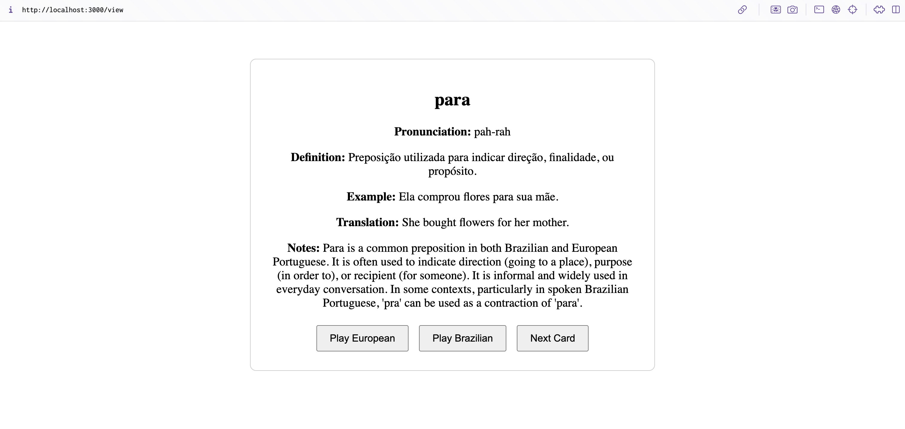

# Portuguese Anki Flashcard Generator

A Node.js application that generates Anki flashcards for Portuguese vocabulary using OpenAI's GPT-4 API.

## Features

- Generates detailed flashcards from Portuguese words
- Includes pronunciation, definitions, example sentences, and usage notes
- Supports both European and Brazilian Portuguese variations
- Validates output using Zod schema
- Saves flashcards in JSON format
- Generates audio for the flashcards using OpenAI API

## Prerequisites

- Node.js installed on your system
- OpenAI API key
- npm or yarn package manager

## Installation

1. Clone the repository:

```bash
git clone https://github.com/yourusername/portuguese-anki.git
cd portuguese-anki
```

2. Install dependencies:

```bash
npm install
```

3. Create a `.env` file in the root directory and add your OpenAI API key:

```

OPENAI_API_KEY=your_openai_api_key

```

## Usage

### Option 1:

Run the script to generate flashcards for 1000 common Portuguese words, extracted from: https://travelwithlanguages.com/blog/most-common-portuguese-words.html

```bash
node script-generate-cards-common-words.js
```

Get the output in the `flashcards_output/all_flashcards.json` file.

### Option 2:

Run the server, that allows you to:

### Generate Flashcards for 1000 common Portuguese words

```bash
curl -X POST http://localhost:3000/generate-flashcards-common-words
```

This will:

- Read words from `portuguese-words.json`
- Generate flashcards using GPT
- Save the output in `flashcards_output/all_flashcards.json`

### Output Format

Each flashcard contains:

- Word
- Pronunciation guide
- Definition in Portuguese
- Example sentence
- English translation
- Usage notes
- Audio files for European and Brazilian Portuguese pronunciations

Example output:

```json
{
  "word": "casa",
  "pronunciation": "kah-zah",
  "definition": "Edificação destinada a ser utilizada como habitação humana.",
  "example_sentence": "Minha casa é pequena, mas muito aconchegante.",
  "sentence_translation": "My house is small, but very cozy.",
  "notes": "• 'Casa' is a feminine noun. \n• Often used in everyday language, both in formal and informal contexts.",
  "audio_european": "/audio/casa_european.wav",
  "audio_brazilian": "/audio/casa_brazilian.wav"
}
```

#### Generate Flashcards for a single word:

```bash
curl -X POST http://localhost:3000/generate-flashcard -H "Content-Type: application/json" -d '{"word": "casa"}'
```

This will:

- Generate a flashcard for the word "casa"
- Save the output in `flashcards_output/all_flashcards.json`

#### Get all the flashcards from the `flashcards_output/all_flashcards.json` file:

```bash
curl http://localhost:3000/flashcards
```

This will:

- Read the `flashcards_output/all_flashcards.json` file
- Return the flashcards in JSON format

## API Server

The application includes an Express server for API access:

1. Start the server:

```bash
npm start
```

The server will run on port 3000 by default

## Configuration

You can modify the following settings:

- Number of words to process (edit `script-generate-cards-common-words.js`)
- GPT model version (in `generate-flashcard.js`)
- Output format (modify the Zod schema in `generate-flashcard.js` and prompt instructions)

## View the flashcards

To view the flashcards (and play the audio), run the server and go to `http://localhost:3000/view`



## Documentation

For more details on the project execution, see the [thought process](documentation/thought_process.txt).

For more details on the prompt used to generate the flashcards, see the [prompts_used_for_cards_generation.txt](documentation/prompts_used_for_cards_generation.txt).

For more details on the prompts used to generate code, see the [prompts_used_for_code_generation.txt](documentation/prompts_used_for_code_generation.txt).
